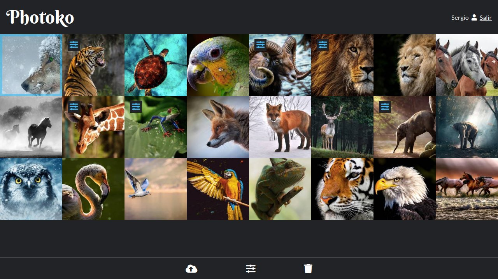

# Photoko

**Photoko** es una aplicación web de revelado de fotografías digitales, que se compone de:

- Un **editor** de fotografías con:
  - Filtros de luz y color para aplicar a la fotografía.
  - Herramientas para facilitar la edición y previsualización: histograma, zoom y reencuadre.
  - Guardado y recuperación automático de los filtros.
  - Renderizado y descarga de la fotografía con los filtros aplicados.
- Una **galería**: Donde cada usuario dispone de un espacio personal y privado, al que puede subir y gestionar sus fotografías.
- Gestión de **usuarios**: Los usuarios administradores pueden administrar la lista de usuarios.

## Algunas capturas

<p>
  <a href="img/editor.jpg" alt="El editor de Photoko">
    
  </a>
  <a href="img/gallery.jpg" alt="La galería de Photoko">
    
  </a>
</p>


## Requisitos

**Photoko** ha sido desarrollado y probado para funcionar con el siguiente stack:

- Nginx 1.16
- PostgreSQL 9.2
- PHP 7.2 / PHP-FPM
- Composer

## Configuración

### Base de datos:

Hemos de crear una base de datos para la aplicación y configurar el acceso a ella en la variable de entorno `DATABASE_URL` del archivo `.env`.

### Email:

Durante el proceso de registro de nuevos usuarios se ha de enviar un email para verificar la autenticidad de la dirección del usuario, por ello hemos de configurar el acceso a una cuenta de correo desde donde enviar los emails de validación.

En el archivo `.env` configuramos la variable de entorno `MAILER_URL` con los datos de conexión SMTP.

### Archivo de fotografías:

Se ha de crear una carpeta donde se almacenarán las fotografías de los usuarios llamada `/photos` y ha de ser accesible con permisos de lectura y escritura por el usuario ejecutor de `php-fpm`.

### Instalación de dependencias:

```shell
php composer.phar install --no-dev --optimize-autoloader
```

### Crear el esquema de datos en la base de datos

```shell
php bin/console make:migration
php bin/console doctrine:migration:migrate
```
